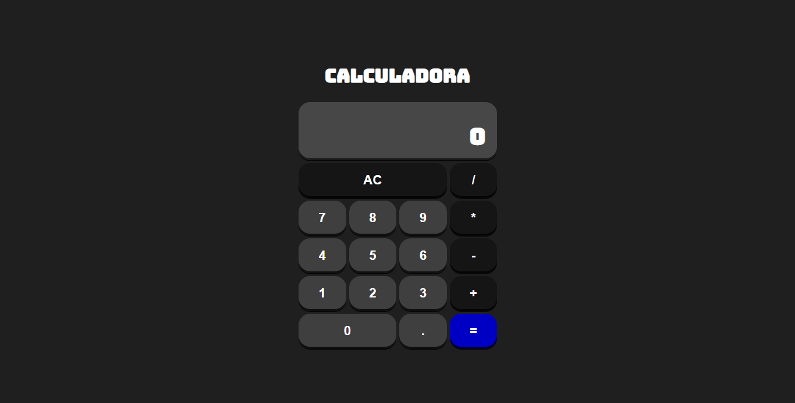

# Calculadora-React.js

## Sobre o projeto:
Projeto desenvolvido no curso de Web Moderno da Cod3r, ode desenvolvemos uma calculadora com a biblioteca React.js. 

O projeto tem como objetivo mostrar como e feita a criação de componentes dentro do React e a manipulação dos estados dentro de um componente, juntamente com a lógica de programação. 

🌐 [🔗 Acessar projeto](https://calculadora-react-js-two.vercel.app/)

## 🛠 Tecnologias:
- HTML
- CSS
- JavaScript
- React.js
- Vite
